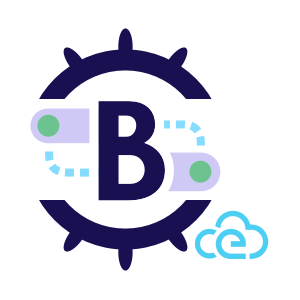

# Brigade CloudEvents Gateway


[](https://codecov.io/gh/brigadecore/brigade-cloudevents-gateway)
[](https://goreportcard.com/report/github.com/brigadecore/brigade-cloudevents-gateway)
[](https://kubernetes.slack.com/messages/C87MF1RFD)



The Brigade CloudEvents Gateway receives webhooks from any
[CloudEvents 1.0](https://cloudevents.io/) event producer and emits them into
Brigade's event bus.

<br clear="left"/>

After [installation](docs/INSTALLATION.md), follow the documentation for any
CloudEvents 1.0 event producer to send CloudEvents to this gateway. Do not
forget to utilize one of the bearer tokens you created during the installation
process for authentication.

Subscribe any number of Brigade
[projects](https://docs.brigade.sh/topics/project-developers/projects/)
to the events emitted by this component -- all of which have a value of
`brigade.sh/cloudevents` in their `source` field and a value of `cloudevent` in
their `type` field.

> ⚠️&nbsp;&nbsp;Because CloudEvents and Brigade events both utilize `source` and
> `type` fields, this gateway adds the values of the CloudEvent's original
> `source` and `type` fields to the native Brigade event as
> [qualifiers](https://docs.brigade.sh/topics/project-developers/events/#qualifiers)
> with the keys `source` and `type`, respectively. The original CloudEvent, in
> its entirety, is added to the the native Brigade event's `payload` field.

In the example project definition below, we subscribe to events from this
gateway (identified by `source: brigade.sh/cloudevents` and `type: cloudevent`)
that originated from an "upstream" CloudEvent producer that labeled its events
with source `example/uri` and type `example.type`:

```yaml
apiVersion: brigade.sh/v2
kind: Project
metadata:
  id: cloudevents-demo
description: A project that demonstrates integration with CloudEvents
spec:
  eventSubscriptions:
  - source: brigade.sh/cloudevents
    types:
    - cloudevent
    qualifiers:
      source: example/uri
      type: example.type
  workerTemplate:
    defaultConfigFiles:
      brigade.js: |-
        const { events } = require("@brigadecore/brigadier");

        events.on("brigade.sh/cloudevents", "cloudevent", () => {
          console.log("Received an event from the brigade.sh/cloudevents gateway!");
        });

        events.process();
```

Assuming this file were named `project.yaml`, you can create the project like
so:

```shell
$ brig project create --file project.yaml
```

## Try it Out

You can use the following `curl` command to send a simulated CloudEvent to the
gateway. This event is subscribed to by the example project in the previous
section.

```shell
$ curl -i -k -X POST \
    -H "ce-specversion: 1.0" \
    -H "ce-id: 1234-1234-1234" \
    -H "ce-source: example/uri" \
    -H "ce-type: example.type" \
    -H "Authorization: Bearer <a token from ~/brigade-cloudevents-gateway-values.yaml>" \
    https://<public IP or host name here>/events
```

> ⚠️&nbsp;&nbsp;Note that the CloudEvent we simulated above utilizes
> [binary content mode](~/brigade-cloudevents-gateway-values.yaml). In this
> mode, all the CloudEvent metadata is included in HTTP request headers, making
> this the most convenient sort of CloudEvent to simulate using `curl` as a
> client. The gateway _also_ supports the more common
> [structured content mode](https://github.com/cloudevents/spec/blob/v1.0/http-protocol-binding.md#32-structured-content-mode)
> wherein CloudEvent metadata is found within the payload itself.

If the gateway accepts the request, output will look like this:

```shell
HTTP/1.1 200 OK
Date: Tue, 03 Aug 2021 19:13:37 GMT
Content-Length: 0
```

To confirm that the gateway emitted a corresponding Brigade event into Brigade's
event bus, list the events for the `cloudevents-demo` project:

```shell
$ brig event list --project cloudevents-demo
```

If this all works out, you should be equally successful wiring CloudEvents from
any CloudEvents 1.0 producer into your Brigade instance.

Full coverage of `brig` commands is beyond the scope of this documentation, but
at this point, additional `brig` commands can be applied to monitor the event's
status and view logs produced in the course of handling the event.

## Contributing

The Brigade project accepts contributions via GitHub pull requests. The
[Contributing](CONTRIBUTING.md) document outlines the process to help get your
contribution accepted.

## Support & Feedback

We have a slack channel!
[Kubernetes/#brigade](https://kubernetes.slack.com/messages/C87MF1RFD) Feel free
to join for any support questions or feedback, we are happy to help. To report
an issue or to request a feature open an issue
[here](https://github.com/brigadecore/brigade-cloudevents-gateway/issues)

## Code of Conduct

Participation in the Brigade project is governed by the
[CNCF Code of Conduct](https://github.com/cncf/foundation/blob/master/code-of-conduct.md).
